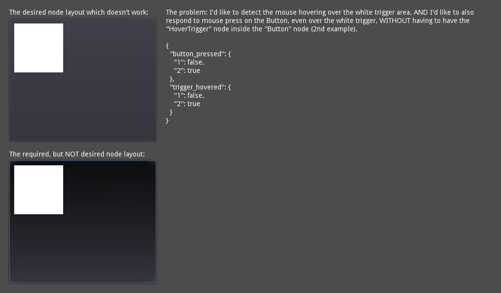

# Input event propagation problem

This project demonstrates a problem I have with Godot's event propagation logic.

Let's say I have a Button that needs to respond to the `pressed` signal. There's another node (called HoverTrigger, visually positioned inside the Button) which also needs to respond to the `mouse_entered` and `mouse_exited` signals, but the Button still needs to remain able to handle the `pressed` signal.

The problem is that for this Godot seems to require the HoverTrigger node to be a descendant of Button, which is not acceptable for my purposes. This demo project implements the desired node layout (where the `pressed` signal is destroyed by the HoverTrigger) and also the undesired node layout (which does work as I'd need).

What's the official way to make the HoverTrigger node _not absorb_ all input events? Or is there a way to re-emit the received input event somehow?

The project requires Godot 3.5 or newer as I'm using "scene unique names".

